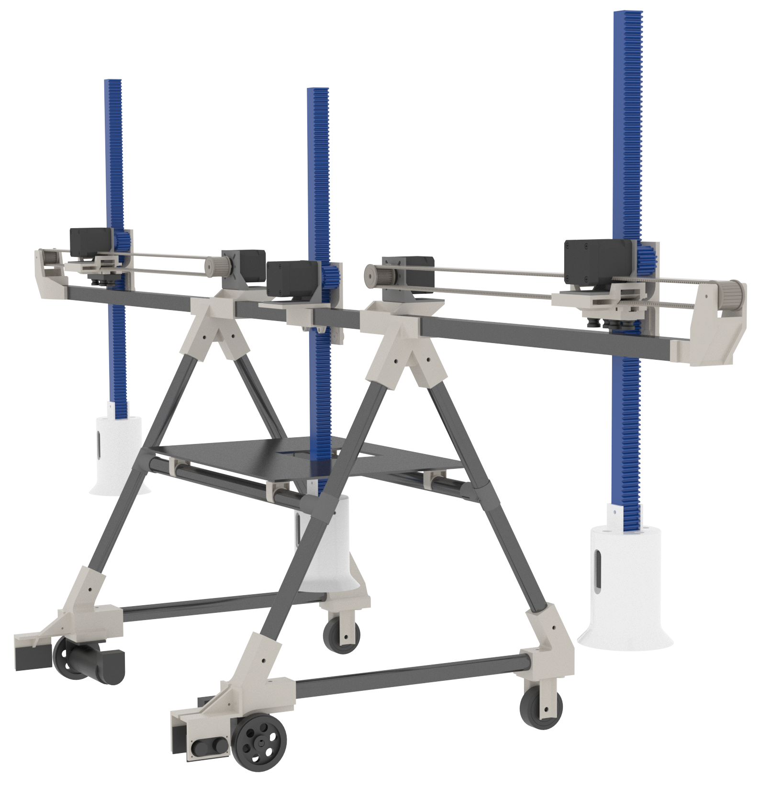
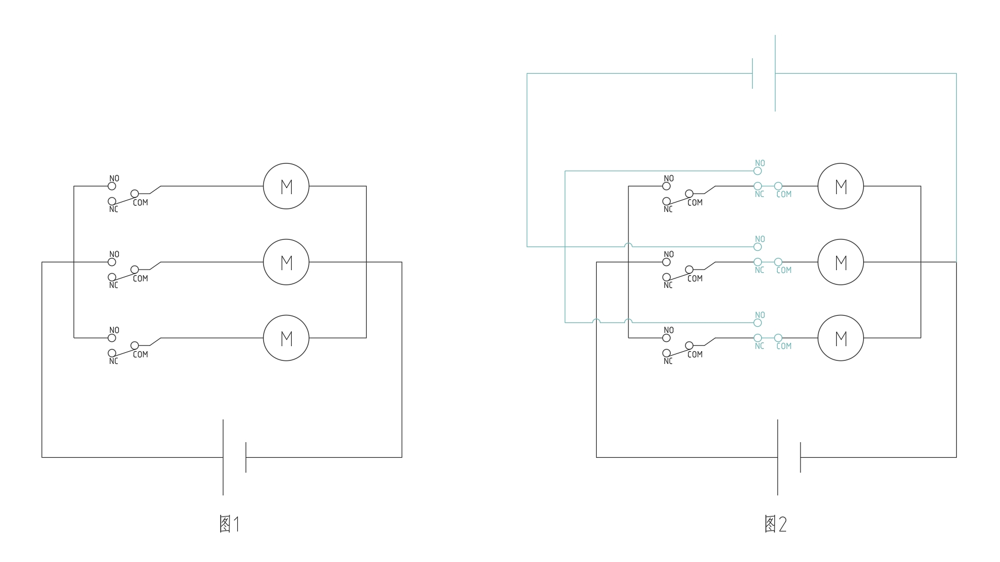
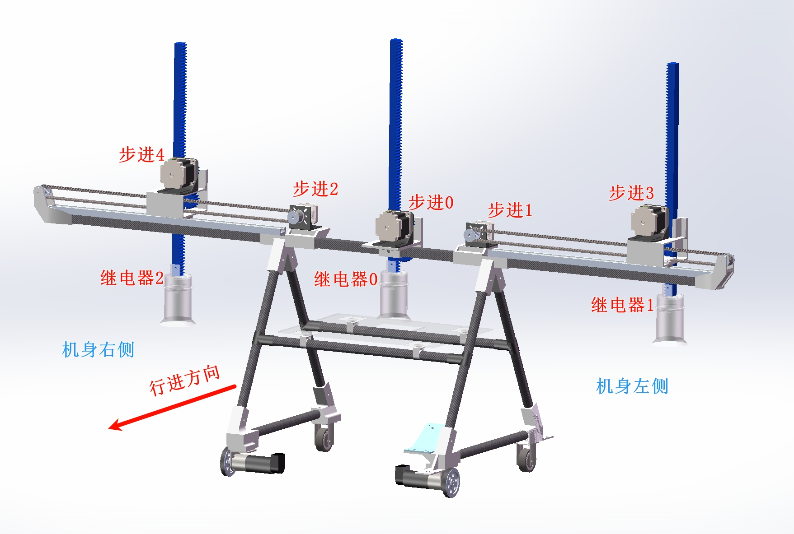
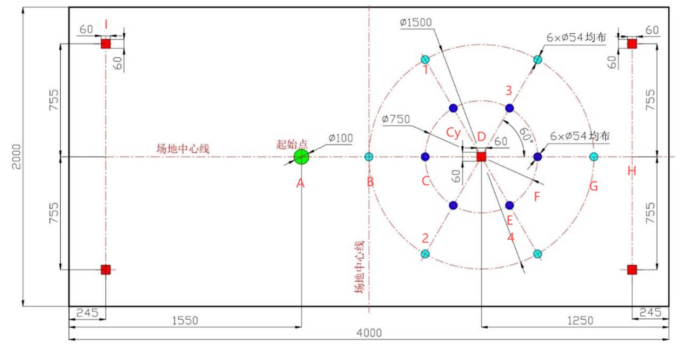

# 简介

此项目是为【2024年中国大学生机械工程创新创意大赛 物流技术（起重机）创意赛】所设计的机器 “三角式双臂磁吸起重机” 的电控源代码。

项目基于STM32F103ZET6开发板、Keil5软件进行开发，文件采用 `Chinese GB2312(Simplified) `编码格式。

# main(master)

保存的是国赛赛场上跑的最新一版代码。
# branch
## Release:
这个分支保存的是省赛代码。其中不包含串口1。
## gyro:
这个分支是master代码的回退，包含陀螺仪的串口命令和串口1。

可以通过串口指令来控制陀螺仪的操作。

## test:
这个分支是当时用来单独测试行进精准度的代码。

# 起重机图片

# 国赛海报

# 特色

采用自设计的消磁电路，继电器断电后通入5ms的反向电流，实现有效消除电磁铁的断电剩磁。

下接线图中，图1为无消磁电路的版本；图2为加入消磁电路的版本。

# 点位示意图

**注意：下图中的 “步进0” 在代码中已替换为 “步进5”.**

