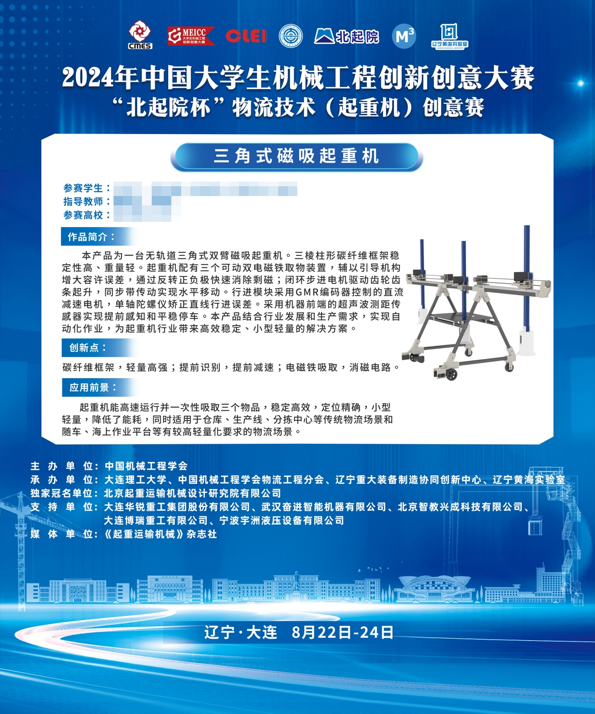
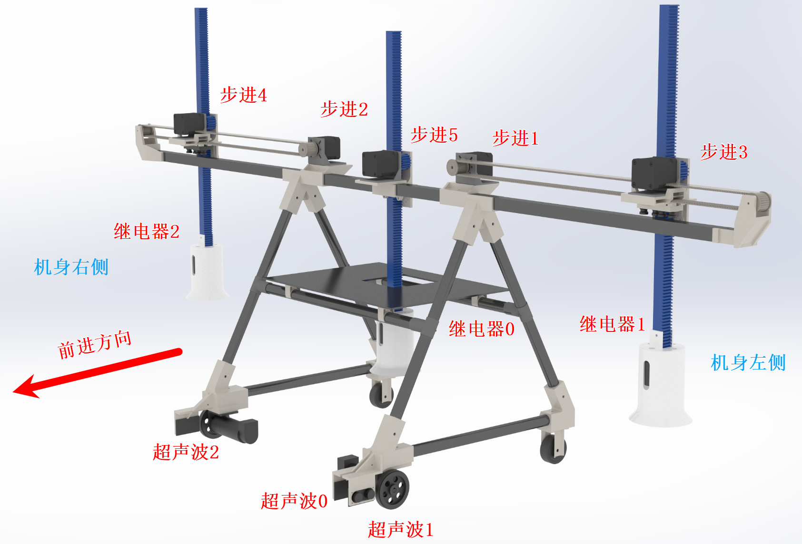

# 三角式双臂磁吸起重机

> **竞赛**: 2024年中国大学生机械工程创新创意大赛 物流技术（起重机）创意赛 · 国赛作品
>
> **主控**: STM32F103ZET6 | **开发环境**: Keil MDK5 | **编码格式**: Chinese GB2312 (Simplified)

---

## 作品简介

本产品为一台**无轨道三角式双臂磁吸起重机**。三棱柱形碳纤维框架稳定性高、重量轻。起重机配有三个可动双电磁铁取物装置，辅以引导机构增大容许误差，通过反转正负极快速消除剩磁；闭环步进电机驱动齿轮齿条起升，同步带传动实现水平移动。行进模块采用GMR编码器控制的直流减速电机，单轴陀螺仪矫正直线行进误差。采用机器前端的超声波测距传感器实现提前感知和平稳停车。

## 创新点

- **碳纤维框架**: 三棱柱形碳纤维框架，轻量高强，提升运行效率和负载能力
- **提前识别与减速**: 超声波传感器提前感知目标物，主动减速实现平稳停车
- **电磁铁消磁电路**: 自设计消磁电路，继电器断电后通入反向电流消除剩磁

## 应用前景

起重机能高速运行并一次性吸取三个物品，稳定高效，定位精确，小型轻量，降低了能耗。同时适用于仓库、生产线、分拣中心等传统物流场景和随车、海上作业平台等有较高轻量化要求的物流场景。

---

## 硬件架构

| 模块 | 型号 | 数量 | 用途 |
|------|------|------|------|
| 主控 | STM32F103ZET6 | 1 | 核心控制 (Cortex-M3, 72MHz) |
| 底盘电机 | 行星减速电机 27:1 (轮趣科技) | 2 | 差速驱动 |
| 编码器 | GMR 500线 AB相 | 2 | 速度/位置反馈 (54000 Counts/Rev) |
| 电机驱动 | D50A大功率MOS双路有刷驱动 12A/24V (轮趣科技) | 2 | PWM驱动 (10kHz) |
| 步进电机 | 闭环步进 (1.8°/32细分) | 5 | 机械臂升降与旋转 |
| 超声波 | HC-SR04 | 3 | 目标物检测 (前/左/右) |
| 陀螺仪 | JY901S (9轴IMU) | 1 | 航向角检测与直线校准 |
| 电磁铁 | 双线圈 | 3 | 物品吸取 |
| 继电器 | 6路 | 1 | 电磁铁吸合/消磁控制 |
| 框架 | 碳纤维三棱柱 | 1 | 机身结构 |

---

## 软件架构

```
main.c             ← 主控制循环、任务调度
Process.c          ← 抓取/放置/行进流程编排
MotorEncoder.c     ← 直流电机PID控制 + 编码器 + 陀螺仪航向修正
L298N.c            ← D50A大功率MOS电机驱动 (文件名沿用L298N)
Stepper.c          ← 步进电机串口协议 + 时序控制
HC-SR04.c          ← 超声波测距 + 滑动窗口滤波
gyroscope.c        ← 陀螺仪数据解析 (WIT协议)
magnet.c           ← 电磁铁继电器 + 消磁电路
SYSTEM/            ← 系统抽象层 (延时/USART/FIFO)
STM32F10x_FWLib/   ← STM32标准外设库 V3.5.0
```

**控制算法**:
- **级联PID**: 外环位置PID + 内环速度PI
- **航向修正**: 陀螺仪Yaw角PD控制
- **速度规划**: 梯形加减速曲线
- **测距滤波**: 15位滑动窗口 + 3/15表决

> 详细技术文档请参阅 [PROJECT_DOCUMENTATION.md](./PROJECT_DOCUMENTATION.md)

---

## 起重机渲染图


## 国赛海报



---

## 特色功能

### 消磁电路

采用自设计的消磁电路，继电器断电后通入反向电流脉冲（约10ms），实现有效消除电磁铁的断电剩磁。

下接线图中，图1为无消磁电路的版本；图2为加入消磁电路的版本。


### 陀螺仪航向校准

采用JY901S九轴陀螺仪的Yaw角数据进行PD航向修正，替代传统的TSL1401线性CCD循迹带方案（原方案需CCD采集128像素线阵图像、二值化识别地面循迹带）。改为陀螺仪方案后，既不需要在地面粘贴循迹带，也不需要铺设和固定轨道，即可保持直线行进。

### 超声波提前感知

3个HC-SR04超声波传感器覆盖三个方向，配合15位滑动窗口滤波算法，实现提前感知目标物并平稳减速停车。

---

## 点位示意图




---

## 分支说明

| 分支 | 说明 |
|------|------|
| **main/master** | 国赛赛场上跑的最新一版代码 |
| **Release** | 省赛代码，不包含USART1 |
| **gyro** | master代码的回退版本，包含陀螺仪的串口命令和USART1，可通过串口指令控制陀螺仪 |
| **test** | 单独测试行进精准度的代码 |

---

## 目录结构

```
Crane_New/
├── CORE/              CMSIS Cortex-M3 核心与启动文件
├── HARDWARE/          硬件驱动层 (传感器/电机/执行器)
│   ├── Process        任务流程编排
│   ├── MotorEncoder   直流电机 PID 控制 + 编码器
│   ├── L298N          直流电机 PWM 驱动 (文件名沿用L298N, 实际为D50A MOS驱动)
│   ├── Stepper        步进电机串口协议控制
│   ├── HC-SR04        超声波传感器 + 滤波
│   ├── gyroscope      陀螺仪驱动 + WIT SDK
│   ├── magnet         电磁铁继电器 + 消磁
│   ├── fifo           循环FIFO缓冲区
│   ├── key/LED        按键 / LED指示灯
│   └── REG.h          陀螺仪寄存器定义
├── SYSTEM/            系统抽象层 (delay/usart/sys)
├── USER/              应用入口 (main.c, Keil工程)
├── STM32F10x_FWLib/   STM32标准外设库 V3.5.0
├── OBJ/               编译输出
└── README.assets/     文档图片
```

---

## 开发环境搭建

1. 安装 **Keil MDK5** 并安装 STM32F1xx 器件包
2. 打开 `USER/NewProject.uvprojx`
3. 确认编码格式设置为 `Chinese GB2312 (Simplified)`
4. 编译下载至 STM32F103ZET6 开发板

---

## License

本项目采用 MIT License，详见 [LICENSE](./LICENSE) 文件。
